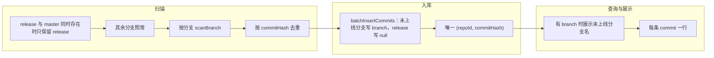

# Commit 扫描去重与分支策略方案

## 现状简要

- **扫描**：[GitScanService](backend/src/services/GitScanService.ts) 的 `getAllBranches()` 同时取**本地 + 远程**分支，按分支逐个 `scanBranch()`，每个 commit 带 `branch`（远程存为去掉 `origin/` 的名称）。
- **入库**：[CommitService.batchInsertCommits](backend/src/services/CommitService.ts) 按 `(repoId, commitHash, branch)` 去重，同一 commit 在不同分支会存**多行**（符合「知道在哪个分支」）。
- **展示**：`getCommitsByDate` 已按 `(date, repoId, commitHash)` 合并为一天一条，但分支只保留第一个，未展示「该 commit 在哪些分支」；分页接口 `getCommits` 未按 commit 聚合，同一 commit 多分支会出现在列表里多条。
- **扫描前**：任务执行前会 [pullRepository](backend/src/services/ScanTaskExecutor.ts)（仅 `git.pull()`，未显式 `--prune`）；若别处执行 `git fetch --prune`，远程已删分支的引用会丢，扫描就扫不到这些分支。

### 需求澄清（修订）

- **分支被删时**：已上线分支被删除后，从 **release** 分支读取历史；存在 release 与 master 时，**默认只扫 release**，再辅以其他分支，按 commit 去重后入库。
- **入库唯一**：同一 commit 在不同分支（如先出现在 feature 再合并到 release）**只插入一次**；唯一标识为 **(repoId, commitHash)**，**不包含 branch**。
- **branch 仅用于未上线分支**：已上线/来自 release 的 commit 可不展示分支；**未上线的分支**希望仍能看到该**分支名字**，故对来自未上线分支的 commit 保留并展示 branch（可选字段）。

下面按「扫描策略」「入库」「展示」给出方案。

---

## 1. 扫描策略：存在 release 与 master 时只扫 release，辅以其他分支并去重

**目标**：避免 release 与 master 重复扫描同一批 commit；以 release 为主、其他分支补充；入库前按 commit 去重。

**做法**：

- 在 [GitScanService](backend/src/services/GitScanService.ts) 中：
  - `getAllBranches()` 在现有逻辑（本地 + 远程）得到分支列表后，做**主分支去重**：
    - 若列表中**同时存在** `release` 与 `master`（或 `origin/release` 与 `origin/master`）：则**只保留 release**（不把 master 加入本次扫描列表），避免对同一段历史扫两遍。
    - 若只有 release 或只有 master，则保留现有行为（都扫）。
    - 其余分支（如 feature/*）全部保留，用于补充尚未合并到 release 的 commit。
  - **性能优化（release 之外的分支）**：对「除 release（及已排除的 master）以外」的每个分支，在调用 `scanBranch()` 前先判断该分支是否已合并到 release——若该分支的**最新 commit（tip）已在 release 中**，说明该分支已上线并合入 release，无需重复扫描。实现方式：取该分支 tip（如 `git rev-parse branch`），再判断该 commit 是否为 release 的祖先（如 `git merge-base --is-ancestor <tip> release` 为 true 即 tip 已在 release 中），若在则**跳过该分支**；否则照常 `scanBranch()`。需要 release 引用存在即可做判断，不要求先扫 release。
  - **扫描顺序（为记录未上线分支名）**：**先扫未上线分支、再扫 release**。这样入库时：来自未上线分支的 commit（含尚未合并到 release 的）会先被插入并带上 branch=分支名；之后扫 release 时同一 commit 若已在库中则跳过，保留已写入的分支名。若先扫 release 再扫未上线分支，则已合并的 commit 会先以 branch=null 入库，无法再补分支名。
  - 扫描时仍按分支逐个对「未跳过」的分支执行 `scanBranch()`，得到 ScannedCommit 列表；在**返回给调用方之前**，按 **commitHash 去重**（同一 repo 下同一 hash 只保留一条；**去重时优先保留带「未上线分支」名的条**，以便入库时能写 branch），再交给入库。

**效果**：

- release 与 master 同时存在时只扫 release，减少重复；其他分支中「已合并到 release」的跳过不扫，只扫尚有未合并 commit 的分支，减少无效扫描。
- 去重后的 commit 列表交给入库逻辑，配合「唯一 (repoId, commitHash)」实现每个 commit 只插一次。

---

## 2. 入库：唯一标识 (repoId, commitHash)，同一 commit 只插一次；branch 仅对未上线分支写入

**目标**：同一 commit **只占一行**；唯一键 **(repoId, commitHash)**；**branch 为可选**：仅当该 commit 来自「未上线分支」时写入分支名，来自 release 或已合并的不写（null）。

**做法**：

- **Schema**（[prisma/schema.prisma](backend/prisma/schema.prisma)）：
  - Commit 表唯一约束改为 `**@@unique([repoId, commitHash])**`，去掉 branch 参与唯一。
  - **branch 字段**：**保留**为可选（nullable）；用于记录「该 commit 来自的未上线分支名」；来自 release 或仅从 release 扫到的 commit 存 null。
- **迁移**：新建 migration：删除原唯一约束 `(repoId, commitHash, branch)`，新增 `(repoId, commitHash)`；对已存在的多行同一 (repoId, commitHash) **去重**（保留一行；若有多行则优先保留 branch 非 null 且非 release 的一行，以便保留未上线分支名），branch 列保留。
- **CommitService.batchInsertCommits**（[CommitService.ts](backend/src/services/CommitService.ts)）：
  - 入参 ScannedCommit 带 branch（扫描层去重时优先保留未上线分支名）；插入时：**若当前条来自未上线分支则写 branch=分支名，若来自 release 则写 branch=null**。
  - 判断「已存在」仅按 `(repoId, commitHash)` 查询；不存在则插入，插入时按上一条规则写 branch。

**说明**：先扫未上线分支、再扫 release，可保证「在未上线分支上出现的 commit」先入库并带上分支名；已上线/仅来自 release 的 commit 为 branch=null，展示时可不显示分支。

---

## 2.5 提交时间语义（author date）

**背景**：例如分支 a 有 commit 1–3，合并到 release 后会产生一条 merge commit。Git 中 commit 1–3 的 hash、作者、**作者时间**不变；merge commit 是新的 commit，时间为合并发生时间。

**约定**：

- 所有展示与统计使用的「提交时间」统一采用 **author date**（作者提交时间），以体现「author 在什么时间、在哪个分支、提交了什么」的真实时间。
- 当前 [GitScanService](backend/src/services/GitScanService.ts) 使用的 `simple-git` 的 `commit.date` 即为 author date；[CommitService](backend/src/services/CommitService.ts) 存储的 `commitDate` 即为此值，**无需改逻辑**。
- 合并产生的 **merge commit** 会作为一条独立记录入库，其时间为合并操作发生时间；普通 commit 1–3 的时间始终为作者当时提交的时间。

**实施**：在实现或文档中明确约定「提交时间 = author date」；若后续需要 committer date，再单独增加字段或说明。

---

## 3. 展示与统计：按 commit 一条一展示；有 branch 时展示未上线分支名

**目标**：库内一 commit 一行；**当 branch 有值时展示该分支名**（未上线分支），无值时（已上线/来自 release）可不展示或显示为「已上线」等。

**做法**：

- **接口形态**：Commit 对象保留 `**branch?: string | null**`（可选）；有值表示该 commit 来自未上线分支，可展示分支名；null 表示来自 release 或已合并，可不展示分支。
- **后端**：
  - [CommitService.getCommitsByDate](backend/src/services/CommitService.ts)、[CommitService.getCommits](backend/src/services/CommitService.ts)：查询时 **select 并返回 branch**；统计仍按 (repoId, commitHash) 一行一 commit 计数。
- **前端**：
  - 类型保留 `branch?: string | null`；表格「分支」列：有 branch 时展示分支名（未上线），无时展示「-」或「已上线」等。
- **忽略分支**：若需保留「忽略分支」能力，可继续按 branch 过滤（如排除 branch 在忽略列表中的记录）；若 branch 为 null 则视为不在任何未上线分支，不参与忽略分支过滤。

---

## 4. 流程与数据流小结

- **扫描**：先扫未上线分支（tip 不在 release 的）、再扫 release；结果按 commitHash 去重（优先保留带未上线分支名的条）后入库。
- **入库**：唯一 (repoId, commitHash)，同一 commit 只插一次；来自未上线分支写 branch=分支名，来自 release 写 null。
- **展示/统计**：有 branch 时展示未上线分支名；库内一 commit 一行，列表与统计自然无重复。

---

## 5. 实施项与文件清单

| 项                                                        | 说明                                                                 | 主要文件                                                                                      |
| -------------------------------------------------------- | ------------------------------------------------------------------ | ----------------------------------------------------------------------------------------- |
| release 与 master 同时存在时只扫 release                         | getAllBranches 中若同时存在 release 与 master，则只保留 release；其余分支不变         | [backend/src/services/GitScanService.ts](backend/src/services/GitScanService.ts)          |
| release 之外分支：tip 已在 release 则跳过                          | 对非 release 分支，若分支 tip 已是 release 的祖先（已合并），则跳过该分支不扫；先扫 release 再扫其余 | [backend/src/services/GitScanService.ts](backend/src/services/GitScanService.ts)          |
| 扫描结果按 commitHash 去重                                      | 在返回给调用方前，按 commitHash 去重（同 repo 下同 hash 只保留一条），每条 commit 只保留一条     | [backend/src/services/GitScanService.ts](backend/src/services/GitScanService.ts)          |
| 扫描顺序：先未上线分支再 release                                     | 先扫未上线分支（插入时写 branch=分支名），再扫 release（写 branch=null），便于保留未上线分支名      | [backend/src/services/GitScanService.ts](backend/src/services/GitScanService.ts)          |
| Schema：唯一 (repoId, commitHash)、保留 branch 可选              | 唯一约束改为 @@unique([repoId, commitHash])；branch 保留为 nullable，仅未上线分支写入 | [backend/prisma/schema.prisma](backend/prisma/schema.prisma)、新建 migration                 |
| 迁移：历史数据去重、保留 branch                                      | 对已有多行同一 (repoId, commitHash) 保留一行，优先保留 branch 非 null 且非 release 的行 | migration SQL                                                                             |
| batchInsertCommits：按 (repoId, commitHash) 判重，未上线写 branch | 插入时来自未上线分支写 branch=分支名，来自 release 写 null                           | [backend/src/services/CommitService.ts](backend/src/services/CommitService.ts)            |
| 提交时间语义                                                   | 约定并文档化：展示/统计用 author date；当前实现已满足                                  | 代码注释或文档                                                                                   |
| 查询与 API 返回 branch                                        | getCommitsByDate / getCommits 返回 branch（有则未上线分支名，无则 null）          | [backend/src/services/CommitService.ts](backend/src/services/CommitService.ts)            |
| 忽略分支逻辑                                                   | 可保留：按 branch 过滤；branch 为 null 不参与忽略分支过滤                            | [backend/src/services/CommitService.ts](backend/src/services/CommitService.ts) 等          |
| 前端展示 branch（未上线分支名）                                      | 表格「分支」列：有 branch 显示分支名，无则显示「-」或「已上线」；类型保留 branch 可选                | [frontend/src/types/gitStatistics.ts](frontend/src/types/gitStatistics.ts)、CommitsTable 等 |

按上述实施后：**存在 release 与 master 时只扫 release，辅以未上线分支（tip 不在 release 的才扫）；先扫未上线分支再扫 release，入库时未上线分支的 commit 写 branch=分支名、release 的写 null；(repoId, commitHash) 唯一；展示时有 branch 则显示未上线分支名。**