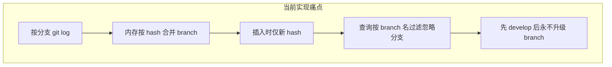

# Git 扫描与去重：技术方案头脑风暴

## 0. 已定产品决策（2026-03-24 确认）

- **核心目标**：在选定 **时间范围** 内，对 **多个已配置仓库**、**配置作者（邮箱）** 的 Git 提交做 **历史汇总**；同一 commit（`repoId + hash`）**只呈现一条**，不因合并进多条分支而重复计数或重复展示。
- **忽略分支**：**不再**让「忽略分支」配置影响上述汇总是否包含某条提交（即取消查询侧按 `branch ∈ 忽略列表` 的硬过滤）。配置项可后续 **弃用、隐藏或仅作兼容占位**，不与「能否看到这条提交」挂钩。
- **技术主路径**：按此前 **方案 A** 落地——以 **全图/多 ref 单次遍历**（如 `git rev-list` + 作者与时间过滤）生成候选集，从根上避免「先写入 develop 分支名导致永久被过滤」类问题；细节见 §2 方案 A 与 §7。
- **Merge commit（已定）**：**纳入**汇总与入库。合并同样耗费时间；你的用途是 **用 commit 记录推算开发工时并回溯**，因此需保留 **每一次与配置作者相关的提交**（含 merge 节点）。实现上 **不使用** `--no-merges` 作为默认策略；若将来要区分「写代码提交 vs 合并提交」，再用单独字段或 UI 维度展示，而非默认丢弃。

---

## 1. 目标与约束（用你的话形式化）

- **数据范围**：每个已配置仓库 × 配置作者（邮箱）× 时间窗 `[start, end]` 内的提交。
- **用途延伸**：汇总用于 **开发工时推算与回溯**，故 **merge commit 保留**（合并亦耗时，且为独立 hash）。
- **去重**：同一逻辑提交在多条分支上出现时，**只计一条**（Git 上同一内容合并进 develop/uat/master 时，**原作者提交 hash 通常不变**，跨分支重复的是「同一条 commit 对象」）。
- **流程背景**：`feature/fix` → `develop` → `uat` → `master`，远端 feature 可能被删；合并会产生 merge commit，但你的原创提交 hash 仍在历史中可达。

当前实现要点见 [backend/src/services/GitScanService.ts](backend/src/services/GitScanService.ts)（按分支扫、`Map` 去重、优先未上线 `branch`）与 [backend/src/services/CommitService.ts](backend/src/services/CommitService.ts)（`repoId+hash` 已存在则整批跳过，**不更新** `branch`；查询时按 [忽略分支](backend/src/services/CommitService.ts) 过滤 `branch`）。

---

## 2. 若从零设计：三条主路线

### 方案 A：单次「全历史图」扫描（推荐优先考虑）

**做法**：在每个仓库内用**一次**面向「所有引用」的日志命令拿到候选集，再按作者与时间过滤，天然 **hash 唯一**。

- 典型命令思路：`git rev-list --all`（或 `--remotes`）配合 `--since` / `--until`，再对每条 hash 取 `git log -1 --format=...`；或 `git log --all --since=... --until=...` 配合脚本去重（rev-list 更高效）。
- **作者过滤**：`--grep` 不适用；应用层用 `--format=%H %ae %at` 过滤邮箱，或与现有一样用 `git log` 的 mailmap。
- **优点**：不依赖「先扫哪条分支」，避免「先写入 develop 分支名再无法纠正」；去重模型与 Git 对象模型一致。
- **缺点**：`--all` 体量大时可加 ref 白名单（只跟踪 develop/uat/master/release + 活跃 remote 分支）。**Merge commit**：本项目已定 **保留**，见 §0 / §3。

**与「忽略分支」的关系**：建议把「忽略分支」从 **「按存储的 branch 字符串删行」** 改为 **「展示策略」**：

- 入库只存：`repoId, hash, author, 时间, message, 统计`；可选存 `**reachable_from`** 位图或 `**lineage`**（见方案 C），而不是单一 `branch` 字符串。
- 或更简单：**查询时不按 `branch` 删提交**，忽略列表只用于「默认不展示纯流水线分支上的重复视图」——若已 A 方案全图扫描，本来每 hash 一行，可不再用 branch 做硬过滤。

### 方案 B：仍以「分支」为遍历单位，但插入改为 upsert + 可升级 `branch` / `tier`

**做法**：保留现有多分支循环，但数据库层对 `repoId+hash` 做 **upsert**：每次扫描根据规则 **更新** `branch` 或 `**deploymentStage`**（例如：`feature_only` → `develop` → `uat` → `production`）。

- **升级规则示例**：若 hash 已可达 `master` tip（`merge-base --is-ancestor`），则把展示字段设为 `production` 或 `branch=null`（表示已进主干），**不再**被「忽略 develop」误伤。
- **优点**：改动相对当前代码路径小，保留「优先看未上线」的语义。
- **缺点**：规则要持续维护（release 与 master 并存、多远端等），与 [getBranchesToScan](backend/src/services/GitScanService.ts) 的分支裁剪逻辑容易再次分叉。

### 方案 C：存「多分支证据」或「可达性」，查询时再解释

**做法**：对 `(repoId, hash)` 存多值表 `commit_branch_appearance(branch_name)`，或每次扫描后计算：

- `is_on_master`、`is_on_develop`、…（对固定环境分支 tip 做 `merge-base --is-ancestor` 批量/抽样）。

**展示**：「忽略 develop」= 不在 UI 里把 develop 当作**主展示维度**，而不是 SQL `branch IN ignored` 直接隐藏行。

- **优点**：最接近你对「合并后仍应有一条记录」的直觉；可回答「当时在哪条线上」。
- **缺点**：表结构与扫描成本上升；需要定义保留多久、是否压缩。

---

## 3. Merge commit（已定：保留）

流水线合并会产生 **merge commit**（新的 hash），与 feature 上的普通提交 **不是同一 hash**，因此不会与「跨分支同一 commit 去重」冲突。

**本产品决策（用户确认）**：**保留所有与配置作者匹配的 merge commit**。理由：合并代码同样消耗时间；目标是 **通过 commit 记录推算开发工时并支持回溯**，需要完整保留与作者相关的提交轨迹。

**实现约束**：扫描路径 **不要**默认加 `--no-merges`。若未来需在报表中区分「编码提交 vs 合并提交」，可扩展 schema 或 UI 标签（例如根据 `git log` 的 parent 数量判断 merge），而不是从汇总中默认剔除 merge。

**文档**：在 [requirements.md](docs/requirements.md) 中写清上述口径，避免与「仅看编码行」类需求混淆。

---

## 4. 与「远端 feature 已删除」的关系

删除远端分支 **不会删除对象**：只要 commit 已合并进 develop/uat/master，**仍可从 `--all` 或主干 log 中解析到**。因此方案 A 不依赖 feature ref 仍存在。

若存在 **仅存在于已删分支、从未合并进任一保留 ref** 的提交，则任何方案都拿不到——这是 Git 事实，不是去重策略问题。

---

## 4.1 忽略分支配置：初衷 vs 当前代码 vs 方案 A

团队里常见理解是：忽略分支用来 **避免重复 commit 入库**、**减少扫描工作量**。与 **当前仓库实现** 对照如下（便于和方案 A 对齐）：

| 目的      | 当前是否由「忽略分支」实现 | 说明                                                                                                                                                                                                                         |
| ------- | ------------- | -------------------------------------------------------------------------------------------------------------------------------------------------------------------------------------------------------------------------- |
| 避免重复入库  | **否**         | 入库去重依赖 `repoId + commitHash` 唯一约束，以及 [GitScanService](backend/src/services/GitScanService.ts) 按 hash 合并；[CommitService](backend/src/services/CommitService.ts) 仅在 **查询/聚合** 阶段用全局合并后的忽略列表过滤「`branch` 字段落在列表中的行」，并不阻止扫描或插入。 |
| 减少扫描工作量 | **否**         | [GitScanService](backend/src/services/GitScanService.ts) **未读取** `IgnoredBranch`；扫哪些 ref 由 `getBranchesToScan()` 等逻辑决定，与配置里的忽略分支无关。                                                                                        |

配置注释（如 [config.schema.ts](backend/src/schemas/config.schema.ts)）写的是「不参与汇总统计」，与上述代码一致。

**若采用方案 A**：

- **为「去重、每 hash 一行」**：**不需要**再依赖忽略分支配置；A 的候选集本身按 commit 对象去重。
- **为「少扫一点 Git」**：方案 A 若用 `rev-list --all` / 宽 ref 集，单次成本可能 **不低于** 甚至 **高于** 当前按分支 `log`；若要优化扫描范围，应单独设计 **ref 白名单或排除 ref 列表**（语义是「扫哪些引用」，与「统计里隐藏 develop」不是同一件事）。
- **为「统计里不展示流水线分支上的记录」**：若 A 取消「按 `branch` 字符串硬过滤行」，该诉求需用 **展示/分组默认值** 或 **可达性口径** 替代；届时「忽略分支」可 **废弃** 或 **改名为 UI/口径配置**，而不是沿用现在的查询删行语义。

**结论**：按你记忆中的两个作用（防重复入库、减扫描），**当前代码并未用忽略分支实现这两项**；方案 A 下也 **不必** 为这两项保留该配置。若产品上仍希望「默认弱化某些环境分支的展示」，可另起一种 **非删行** 的配置或规则，与现「忽略分支」解耦。

---

## 5. 推荐结论（头脑风暴落地）

**当前选型**：已采纳 **方案 A** + **取消忽略分支对汇总的硬过滤**（见 §0）。方案 B/C 保留为回退或增强项。

| 优先级    | 建议                                                                                                                                                                |
| ------ | ----------------------------------------------------------------------------------------------------------------------------------------------------------------- |
| 第一（已选） | **方案 A**：每仓库单次 `rev-list`/`log --all`（或受限 ref 集）+ 作者与时间过滤 → 每 hash 一行入库；**查询不再按忽略分支删行**（与「多仓库时间窗汇总」目标一致）。                                                         |
| 第二     | 若必须少动产品语义：**方案 B**：保留多分支扫，但 `**batchInsertCommits` 改为 upsert**，并在扫描结束对已有 hash 用「是否已进 master/release」**回写** `branch`/阶段，修复文档中 [§2.7.7 已知限制](docs/requirements.md)。 |
| 第三     | 长期可做 **方案 C** 的多分支证据表，支撑更细的分析视图。                                                                                                                                  |

---

## 6. 和现有文档的衔接

- [docs/requirements.md](docs/requirements.md) 需改写 §2.7.7 / 忽略分支：与 §0 一致——**汇总口径不再因忽略分支隐藏提交**；并补充方案 A 扫描与 merge 策略。
- [docs/unresolved-followups.md](docs/unresolved-followups.md) 中的待验证项（是否扫描成功、作者邮箱等）仍适用；**技术方案选定后**应用同一套检查步骤回归 monkey-saas-web 场景。

---

## 7. 实现清单（与 §0 对齐）

- [GitScanService.ts](backend/src/services/GitScanService.ts)：新增 `scanRepositoryFlat`（或等价），以 `rev-list`/`--all` 或约定 ref 集 + `--since`/`--until` + 作者过滤生成 **唯一 hash** 列表，再批量取 metadata/diff 统计；与 [ScanTaskExecutor](backend/src/services/ScanTaskExecutor.ts)、[repositories 扫描路由](backend/src/routes/repositories.ts) 对接。
- [CommitService.ts](backend/src/services/CommitService.ts)：**删除** `getCommitsByDate` / 列表 / 原生 SQL 路径中对 `getAllIgnoredBranches()` 的过滤；`branch` 字段可保留为展示元数据或逐步弱化。
- 前端配置：忽略分支编辑 **隐藏或标注弃用**（[config 相关路由与页面](backend/src/routes/config.ts)、配置 UI），避免用户误以为仍能影响汇总。
- 测试：同 hash 跨分支合并进主干后，**仍在时间窗汇总中可见**；多仓库联合筛选与作者筛选不变。

