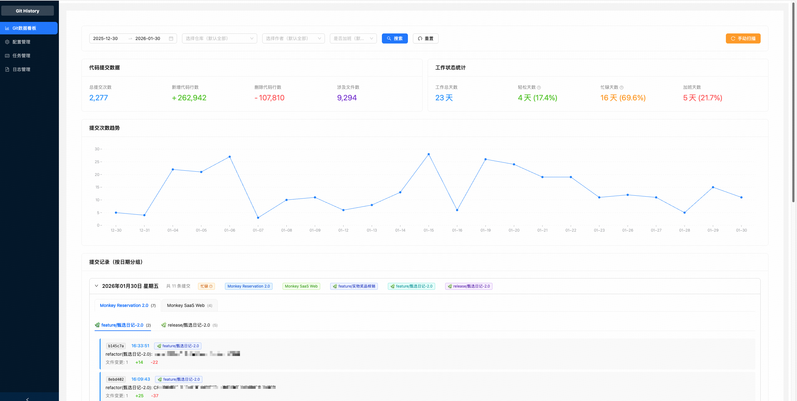
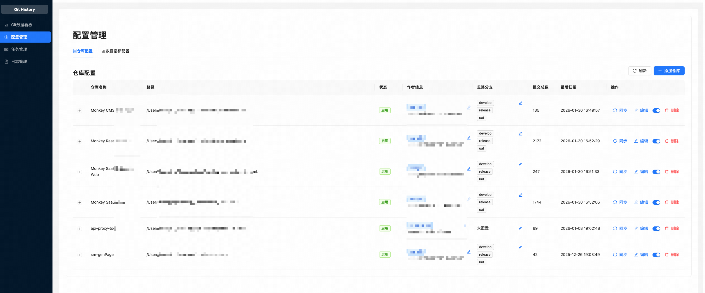
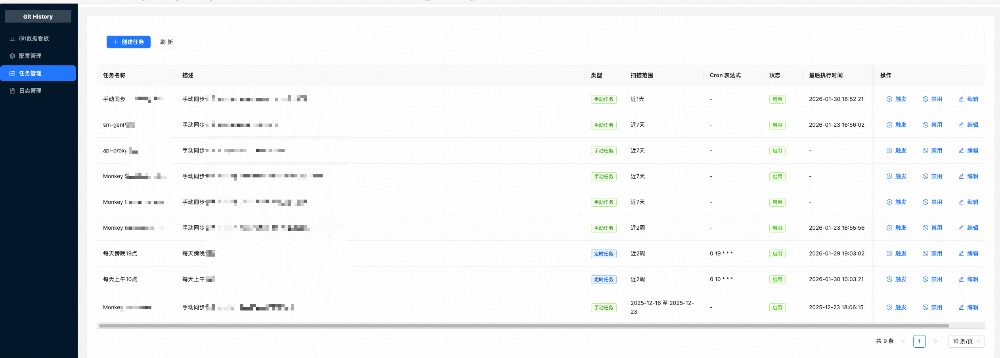
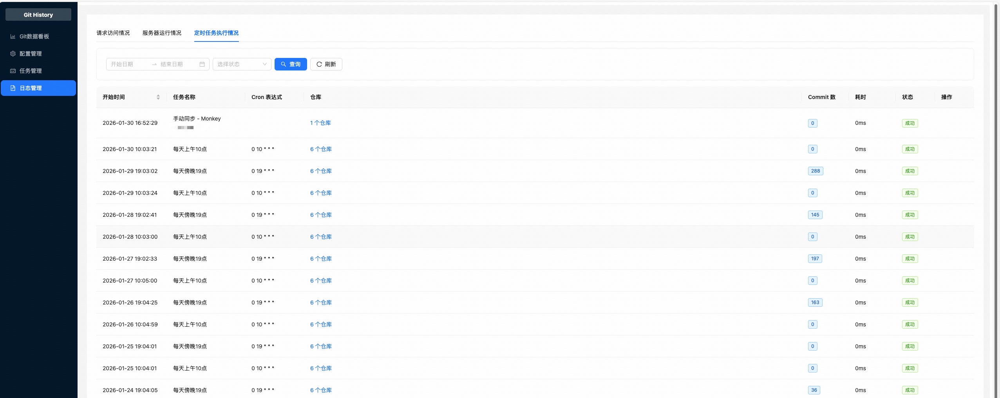

# Coding History - 代码提交记录统计系统

一个全栈 Web 应用，用于统计和展示多个本地 Git 仓库的提交记录。


## 预览

<table>
  <tr>
    <td></td>
    <td></td>
  </tr>
  <tr>
    <td></td>
    <td></td>
  </tr>
</table>

## 技术栈

### 后端
- **Hono.js** - 轻量级、高性能的 Web 框架
- **Zod** - TypeScript-first 的数据验证
- **better-sqlite3** - SQLite 数据库
- **simple-git** - Git 操作
- **node-cron** - 定时任务
- **pino** - 日志记录

### 前端
- **React 18** + **TypeScript**
- **Ant Design 5.x** - UI 组件库
- **Jotai** - 状态管理
- **ahooks** - React Hooks 库
- **ramda** - 函数式编程工具
- **dayjs** - 日期处理

### 包管理器
- **pnpm** - 快速、节省磁盘空间的包管理器

## 项目结构

```
coding-history/
├── backend/              # 后端项目
│   ├── src/
│   │   ├── config/       # 配置文件
│   │   ├── schemas/      # Zod schemas
│   │   ├── services/     # 业务服务
│   │   ├── routes/       # API 路由
│   │   ├── db/           # 数据库相关
│   │   ├── jobs/         # 定时任务
│   │   └── index.ts      # 入口文件
│   ├── config/           # 仓库配置文件（已废弃，仅用于迁移）
│   └── database/         # SQLite 数据库文件
├── frontend/             # 前端项目
│   └── src/
│       ├── pages/        # 页面组件
│       ├── biz/          # 业务逻辑（atoms）
│       ├── services/     # API 服务
│       └── types/        # 类型定义
└── README.md
```

## 快速开始

### 1. 环境准备

#### 系统要求
- **Node.js**: 20.19.6 (通过 volta 自动管理)
- **pnpm**: 10.15.0 (通过 volta 自动管理)
- **Git**: 用于仓库扫描

#### 安装 Volta 和工具链
```bash
# 安装 Volta (如果还没有安装)
curl https://get.volta.sh | bash

# 安装项目所需的工具链 (volta 会自动切换到正确版本)
volta install node@20.19.6
volta install pnpm@10.15.0

# 或者直接在项目目录下运行 (volta 会自动读取 .volta.json 配置)
volta install
```

**Volta 的优势：**
- 🚀 自动切换到项目所需的 Node.js 版本
- 📦 项目级别的工具版本管理
- ⚡ 快速版本切换，无需手动操作
- 🔒 确保团队成员使用相同的工具版本

### 2. 项目初始化

#### 克隆项目
```bash
git clone <repository-url>
cd coding-history
```

#### 安装依赖
```bash
# 在项目根目录安装所有依赖
pnpm install
```

#### 重要：处理二进制模块兼容性
如果遇到 `better-sqlite3` 模块版本不匹配问题，请执行：

```bash
# 方式一：重新编译二进制模块
pnpm rebuild better-sqlite3

# 方式二：完全重新安装后端依赖（推荐）
cd backend
rm -rf node_modules
pnpm install
cd ..
```

**说明**：better-sqlite3 是包含 C++ 代码的二进制模块，当 Node.js 版本变化时需要重新编译。

### 2. 环境变量配置（可选）

#### 后端环境变量（backend/.env）

在 `backend` 目录下可以创建 `.env` 文件来配置环境变量：

常用配置可直接参考 `backend/.env.example`。

Redis 查询缓存为可选能力，单机开发可以不启用，不要求本机安装 Redis 或 `redis-cli`。
如果需要启用缓存、在 macOS 上安装客户端或排查 Key/TTL，请参阅
[Redis 查询缓存快速使用](./docs/redis-cache-quickstart.md)。


### 3. 配置仓库

**注意**: 配置已迁移到数据库，请使用前端配置管理页面进行配置。

#### 首次使用（从配置文件迁移）

如果您有旧的 `backend/config/repositories.json` 配置文件，可以运行迁移脚本将其导入数据库：

```bash
cd backend
pnpm migrate-config
```

#### 使用配置管理页面

1. 启动后端和前端服务
2. 访问前端页面，点击左侧菜单的"配置管理"
3. 在配置管理页面可以：
   - **仓库配置**：添加/编辑/删除仓库，启用/禁用仓库
   - **作者配置**：为每个仓库配置作者信息（用于过滤提交记录）
   - **数据指标配置**：配置工作状态判断的阈值、标签文本和颜色
     - 提交次数阈值（轻松、正常、忙碌、疯狂）
     - 加班时间阈值（默认 19:00）
     - 工作状态标签文本（可自定义显示文本）
     - 工作状态标签颜色（支持 Ant Design 的所有颜色）

#### 旧配置文件格式（仅用于迁移）

如果您需要从旧的配置文件迁移，格式如下：

```json
{
  "repositories": [
    {
      "id": "my-project",
      "name": "我的项目",
      "path": "/path/to/your/repository",
      "enabled": true
    }
  ],
  "authors": [
    {
      "name": "Your Name",
      "email": "your.email@company.com",
      "isDefault": true
    }
  ],
  "scanInterval": [
    {
      "cron": "0 10 * * *",
      "description": "每天上午10点"
    }
  ]
}
```

（若旧文件含 `ignoredBranches` 字段，迁移脚本会忽略该字段；统计与列表不依赖分支忽略配置。）

### 4. 启动服务

使用 PM2 在后台启动服务，不占用终端窗口：

```bash
# 启动服务（后台运行）
pnpm start

# 查看服务状态
pnpm status

# 查看日志
pnpm logs

# 停止服务
pnpm stop

# 重启服务
pnpm restart

# 删除进程
pnpm delete
```

`pnpm start` 和 `pnpm restart` 默认会尝试启动本机 `redis-server`，并用 `redis-cli ping`
检查可用性；缺少 Redis 工具时只会输出警告，后端自动使用 Node 进程内缓存。`pnpm stop`、
`pnpm delete` 和 `pnpm reset` 会关闭由本项目启动的 Redis，不会影响用户已有的 Redis 服务。
前端固定使用 `127.0.0.1:5173`；如果该端口被其他项目占用，启动会提前失败并显示占用进程，
需要先停止占用者后再执行 `pnpm start`。如果不希望停止其他项目，可以指定备用端口：

```bash
FRONTEND_PORT=5174 pnpm start
```

此时访问 `http://localhost:5174`，API 代理仍指向后端 `5188` 端口。

**PM2 启动的优势：**
- 服务在后台运行，不占用终端窗口
- 自动重启（进程崩溃时）
- 日志管理（输出到文件）
- 进程监控和管理

### 5. 首次使用

1. **配置仓库**（如果还没有配置）:
   - 访问前端页面 `http://localhost:5173`
   - 点击左侧菜单的"配置管理"
   - 添加仓库、配置作者

2. **初始化历史数据**（可选）:
   ```bash
   cd backend
   pnpm init-scan  # 扫描最近3个月的数据
   pnpm init-scan --months 6  # 扫描最近6个月的数据
   ```

   项目启动后不会自动执行首次扫描。日常依赖页面里的手动扫描和自动定时任务；只有需要补历史数据时才手动运行 `pnpm init-scan`。

3. **查看统计数据**:
   - 访问 Git 数据看板页面
   - 通过时间范围和仓库筛选查看统计数据

## 新维护人员快速上手指南

### 🚀 首次启动检查清单

在首次启动项目前，请按以下步骤操作：

#### ✅ 步骤 1: 环境检查
```bash
# 进入项目目录 (volta 会自动切换到正确版本)
cd coding-history

# 检查工具版本 (volta 会自动管理)
node --version    # 应该显示 20.19.6
pnpm --version    # 应该显示 10.15.0
```

如果版本不符合要求，请安装 volta 并设置工具链：
```bash
# 安装 volta (如果还没有)
curl https://get.volta.sh | bash

# 重新加载 shell 配置
source ~/.bashrc  # 或 ~/.zshrc

# 在项目目录下安装正确版本的工具
volta install
```

#### ✅ 步骤 2: 依赖安装
```bash
# 在项目根目录
pnpm install
```

#### ✅ 步骤 3: 二进制模块处理
```bash
# 检查 better-sqlite3 是否正常
cd backend
node -e "require('better-sqlite3'); console.log('✅ better-sqlite3 正常')"

# 如果报错，执行以下命令之一：
# 方式一：重新编译
pnpm rebuild better-sqlite3

# 方式二：完全重新安装（推荐）
rm -rf node_modules
pnpm install
cd ..
```

#### ✅ 步骤 4: 数据库初始化
```bash
# Prisma 会自动生成客户端，但可以手动执行
cd backend
pnpm postinstall
cd ..
```

#### ✅ 步骤 5: 启动服务
```bash
# 使用 PM2 后台启动
pnpm start

# 检查服务状态
pnpm status

# 查看日志确认无错误
pnpm logs
```

#### ✅ 步骤 6: 验证服务
```bash
# 检查后端健康状态
curl http://localhost:5188/health

# 检查前端是否可访问
curl -I http://localhost:5173
```

### 🐛 常见问题解决

#### 问题 1: better-sqlite3 版本不匹配
**错误信息**: `NODE_MODULE_VERSION 115. This version of Node.js requires NODE_MODULE_VERSION 127`

**解决方案**:
```bash
cd backend
rm -rf node_modules
pnpm install
```

#### 问题 2: 端口被占用
**错误信息**: `Port 5173 is in use` 或 `Port 5188 is in use`

**解决方案**:
```bash
# 查找占用端口的进程
lsof -i :5173
lsof -i :5188

# 停止占用进程或修改端口配置
```

#### 问题 3: PM2 启动失败
**错误信息**: `App [coding-history-backend] exited with code [1]`

**解决方案**:
```bash
# 查看详细日志
pm2 logs coding-history-backend

# 重新安装依赖后重启
cd backend && rm -rf node_modules && pnpm install && cd ..
pm2 restart all
```

#### 问题 4: Git 仓库权限问题
**错误信息**: `Permission denied` 或 `fatal: not a git repository`

**解决方案**:
```bash
# 确保仓库路径正确且有读取权限
ls -la /path/to/your/repository
git status /path/to/your/repository
```

### 📝 开发环境配置

#### VSCode 推荐插件
- TypeScript
- Prettier
- ESLint
- GitLens
- Prisma

#### 环境变量配置
创建 `backend/.env` 文件，可直接参考 `backend/.env.example`。

### 🔄 日常维护命令

```bash
# 启动服务
pnpm start

# 停止服务
pnpm stop

# 重启服务
pnpm restart

# 查看状态
pnpm status

# 查看日志
pnpm logs

# 手动补历史数据
pnpm init-scan

# 清理日志
cd backend && pnpm clean-logs
```

### 📁 重要文件位置

- **数据库文件**: `backend/database/coding-history.db`
- **日志文件**: `backend/logs/` 和 `frontend/logs/`
- **PM2 配置**: `ecosystem.config.cjs`
- **PM2 配置**: `ecosystem.config.cjs`
- **PM2 管理脚本**: `scripts/pm2-*.sh`

## 功能特性

- ✅ 多仓库支持
- ✅ 增量扫描（只扫描新增提交）
- ✅ 定时自动扫描（可配置 cron 表达式）
- ✅ 时间范围筛选（最近一周、最近一个月、自定义范围）
- ✅ 仓库筛选
- ✅ 统计数据展示（提交次数、代码行数、文件变更数）
- ✅ 提交记录表格（支持分页、排序）
- ✅ 数据持久化（SQLite）
- ✅ 配置管理（数据库存储，支持前端界面管理）
  - 仓库配置（添加/编辑/删除仓库）
  - 作者配置（为每个仓库配置作者信息）
  - 数据指标配置（配置工作状态判断阈值、标签文本和颜色）
- ✅ 任务管理（支持手动和定时任务）
- ✅ 日志管理（请求日志、定时任务日志、服务器日志）

## API 接口

### 仓库管理
- `GET /api/v1/repositories` - 获取所有仓库
- `GET /api/v1/repositories/:id` - 获取单个仓库
- `POST /api/v1/repositories/scan` - 手动触发扫描

### 提交记录
- `GET /api/v1/commits` - 获取提交记录列表（支持分页）

### 统计数据
- `GET /api/v1/statistics` - 获取统计数据

## 开发

### 后端开发

```bash
cd backend
pnpm dev  # 开发模式，支持热重载
```

### 前端开发

```bash
cd frontend
pnpm dev  # 开发模式
```

### 构建

```bash
# 构建后端
cd backend
pnpm build

# 构建前端
cd frontend
pnpm build
```

## 注意事项

1. **权限问题**: 确保应用有权限访问配置的 Git 仓库路径
2. **首次扫描**: 对于大型仓库，首次扫描可能需要较长时间
3. **数据备份**: 定期备份 SQLite 数据库文件（`backend/database/coding-history.db`）
4. **时区处理**: 确保前后端时区一致
5. **Node.js 版本**: 使用 volta 自动管理版本，确保团队环境一致性
6. **二进制模块**: 升级 Node.js 后必须重新编译 better-sqlite3 模块
6. **PM2 管理**: 使用 PM2 后台运行时，通过 `pnpm status:pm2` 监控服务状态

## 故障排除

### 🔍 服务无法启动

1. **检查 Node.js 版本**: `node --version` (需要 20.19.6，volta 自动管理)
2. **重新安装依赖**: `rm -rf node_modules && pnpm install`
3. **检查端口占用**: `lsof -i :5173` 和 `lsof -i :5188`
4. **查看详细日志**: `pm2 logs` 或 `pnpm logs:pm2`

### 🔍 数据库问题

1. **检查数据库文件**: `ls -la backend/database/`
2. **重新生成 Prisma 客户端**: `cd backend && pnpm postinstall`
3. **数据库迁移**: `cd backend && pnpm migrate-config`

### 🔍 PM2 问题

1. **重置 PM2**: `pm2 kill && pm2 start ecosystem.config.cjs`
2. **删除并重建**: `pnpm delete:pm2 && pnpm start:pm2`
3. **检查配置文件**: `cat ecosystem.config.cjs`

## 📚 相关文档

- [Redis 查询缓存快速使用](./docs/redis-cache-quickstart.md) - Redis 启用、macOS `redis-cli` 安装与基础命令

- [快速上手指南](./QUICKSTART.md) - 新维护人员详细指南
- [Volta 配置说明](./VOLTA.md) - 工具版本管理
- [使用指引](./使用指引.md) - 功能使用说明
- [Prisma 数据库迁移文档](./prisma数据库迁移同步流程文档.md) - 数据库相关

## 许可证

MIT
