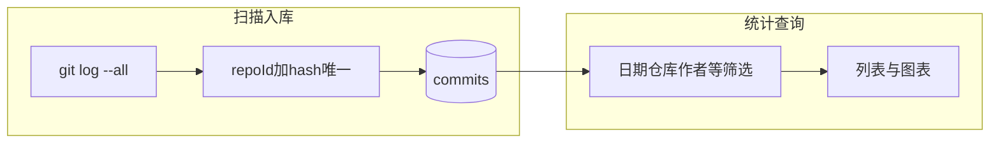

# Git 提交记录统计系统 - 需求文档

## 版本信息
- **文档版本**: v1.3.1
- **创建日期**: 2025-11-21
- **最后更新**: 2026-03-27

---

## 1. 项目概述

### 1.1 项目背景
开发一个 Git 提交记录统计系统，用于追踪和分析多个 Git 仓库的提交记录，帮助开发者了解自己的编码工作状态和加班情况。

### 1.2 核心功能
- 多仓库 Git 提交记录扫描与入库（手动扫描、定时/手动任务；全引用 `git log --all`、按 commit 去重，**含 merge commit**）
- 仓库与作者等配置管理；**忽略分支**仅存库兼容，**不再影响**列表与统计汇总
- 按日期分组展示提交记录（受日期/仓库/作者/加班等筛选影响）
- 工作状态自动判断（阈值可配置）
- 加班记录识别和统计
- 工作状态统计报表（图表展示）
- 请求与任务执行等日志查询（辅助运维）

---

## 2. 功能需求

### 2.1 数据展示功能

#### 2.1.1 按日期分组展示
**需求描述**：
- 提交记录需要按日期分组展示
- 每个日期使用折叠面板（Collapse）展示
- 默认展开第一天的数据

**展示内容**：
- 日期（格式：YYYY年MM月DD日 dddd）
- 当天总提交数
- 工作状态标签
- 加班提醒标签（如有）

#### 2.1.2 按日期内 Tab 展示（全览 + 按仓库）
**需求描述**：
- 每个日期折叠面板内，使用 **一级 Tab** 展示当天提交；**第一个 Tab 固定为「全览」**，其后各 Tab 按**仓库**划分（与原有行为一致）
- **默认激活「全览」Tab**，便于进入某日即看到当日时间线

**「全览」Tab**：
- 汇总该日**所有仓库**的提交，**按提交时间升序**（从早到晚）排列，便于回顾当日跨仓库的工作顺序
- 每条记录需标明**所属仓库**（如标签），其余字段与 §2.1.3 一致（hash、时间、分支、message、增删行、加班等）
- 超过 10 条时，列表区域可纵向滚动（最大可视高度与按仓库 Tab 内列表一致，如约 500px）

**按仓库 Tab**（第二个 Tab 起）：
- Tab 标题：仓库名称 + (该仓库当日提交数量)
- Tab 内容：该仓库内再按**分支**使用二级 Tab 展示提交（保持原有结构）
- 超过 10 条记录时，内容区域可滚动（最大高度约 500px～600px，与实现一致即可）

#### 2.1.3 提交记录详情展示
**需求描述**：
每条提交记录需要展示以下信息：
- Commit Hash（前 7 位，code 样式）
- 提交时间（HH:mm:ss 格式，蓝色高亮显示）
- 提交信息（commit message）
- 文件变更数量
- 代码行数变更（新增/删除，绿色/红色显示）
- 加班标签（如为加班提交，显示红色"加班"标签）

**样式要求**：
- 每条记录使用左侧边框线分隔
- 提交时间颜色：`#1890ff`（蓝色），字体粗细：500
- 新增代码行数：绿色（`#52c41a`）
- 删除代码行数：红色（`#ff4d4f`）

---

### 2.2 工作状态判断功能

#### 2.2.1 工作状态规则
**需求描述**：
系统需要根据每天多仓库合并提交次数和加班情况，自动判断工作状态。

**判断规则**：

| 提交次数 | 是否有加班（19:00后） | 工作状态 | 标签颜色 |
|---------|---------------------|---------|---------|
| < 6 次 | 否 | 轻松 | 绿色 |
| 6-10 次 | 否 | 正常 | 蓝色 |
| 10-15 次 | 否 | 忙碌 | 橙色 |
| 15-20 次 | 否 | 疯狂 | 红色 |
| ≥ 20 次 | 否 | 疯狂 | 红色 |
| < 20 次 | 是 | 加班 | 红色 |
| ≥ 20 次 | 是 | 超级疯狂加班 | 洋红色 |

**优先级说明**：
- 如果存在 19:00 后的提交记录，优先显示加班相关状态
- 提交次数 ≥ 20 次且存在加班记录时，显示"超级疯狂加班"

#### 2.2.2 工作状态配置
**需求描述**：
工作状态判断规则需要支持配置化，便于后续调整。配置已迁移到数据库，支持通过前端界面进行配置。

**配置方式**：
1. **前端配置界面**（推荐）：访问"配置管理" → "数据指标配置"标签页
2. **默认配置**：`backend/src/config/workStatus.config.ts`

**配置项**：
```typescript
{
  thresholds: {
    relaxed: 6,      // 轻松阈值：提交次数 < 此值
    normal: 10,      // 正常阈值：>= relaxed 且 < normal
    busy: 15,        // 忙碌阈值：>= normal 且 < busy
    superCrazy: 20  // 疯狂阈值：>= busy 且 < superCrazy，>= 此值：超级疯狂
  },
  overtimeHour: 19,  // 加班时间阈值（小时）：提交时间 >= 此时间判定为加班
  labels: {          // 工作状态标签文本（可自定义）
    relaxed: '轻松',
    normal: '正常',
    busy: '忙碌',
    crazy: '疯狂',
    overtime: '加班',
    superCrazyOvertime: '超级疯狂加班'
  },
  colors: {          // 工作状态标签颜色（Ant Design Tag colors）
    relaxed: 'green',
    normal: 'blue',
    busy: 'orange',
    crazy: 'red',
    overtime: 'red',
    superCrazyOvertime: 'magenta'
  }
}
```

**配置功能**：
- ✅ 支持通过前端界面配置所有参数
- ✅ 配置实时生效，无需重启服务
- ✅ 支持预览配置效果
- ✅ 配置验证（阈值必须递增，颜色值必须有效）
- ✅ 配置存储在数据库中，持久化保存

#### 2.2.3 工作状态展示
**需求描述**：
- 在日期面板头部显示工作状态标签
- 标签颜色根据状态类型自动设置
- 标签文本使用中文显示

---

### 2.3 加班记录功能

#### 2.3.1 加班识别规则
**需求描述**：
- 提交时间 ≥ 19:00 的提交记录判定为加班
- 每个提交记录包含 `isOvertime` 字段标识是否为加班提交
- 加班提交在列表中显示红色"加班"标签

#### 2.3.2 加班统计展示
**需求描述**：
- 日期面板头部显示当天加班提交数量
- 如有加班记录，显示"又加班 (X次)"标签
- Hover 标签时，显示最晚的 5 个加班提交时间点

**展示格式**：
```
又加班 (2次) [红色标签，带时钟图标]
Hover 提示：
加班提交时间：
• 20:30
• 19:15
```

---

### 2.4 筛选功能

#### 2.4.1 日期范围筛选
**需求描述**：
- 支持选择日期范围进行筛选
- 默认筛选条件：最近一个月
- 提供快速选择选项：
  - 最近一周
  - 最近一个月
  - 最近三个月
  - 最近半年
  - 最近一年
- 时间范围不能超过 2 年

#### 2.4.2 仓库筛选
**需求描述**：
- 支持多选仓库进行筛选
- 默认选择全部仓库
- 下拉框支持搜索和清除

#### 2.4.3 作者筛选（统计查询）
**需求描述**：
- 支持按**作者邮箱**多选筛选（仅影响列表与统计接口的查询结果）
- 默认不选表示**全部作者**
- **说明**：此筛选与「扫描入库」时使用的作者规则**相互独立**——入库仅认各仓库在配置中维护的作者邮箱（见 §2.7）

#### 2.4.4 加班筛选
**需求描述**：
- 支持按是否加班进行筛选
- 选项：
  - 全部：显示所有提交
  - 仅加班：只显示 19:00 后的提交
  - 非加班：只显示 19:00 前的提交

#### 2.4.5 重置功能
**需求描述**：
- 提供"重置"按钮
- 点击后恢复默认筛选条件：
  - 日期范围：最近一个月
  - 仓库：全部
  - 作者：全部
  - 加班筛选：全部
- 重置后自动触发搜索

---

### 2.5 工作状态统计报表功能

#### 2.5.1 统计卡片展示
**需求描述**：
- 在筛选条件下方显示工作状态统计报表
- 左侧以卡片形式展示统计数据
- 右侧展示折线图

**统计卡片内容**：
1. **工作总天数**
   - 显示周期内有提交代码的天数
   - 颜色：蓝色（`#1890ff`）
   - 格式：`X 天`

2. **轻松天数**
   - 统计工作状态为"轻松"的天数
   - 颜色：绿色（`#52c41a`）
   - 格式：`X 天 (XX.X%)`
   - 占比计算：轻松天数 / 工作总天数 × 100%

3. **忙碌天数**
   - 统计工作状态为"忙碌"、"疯狂"、"加班"、"超级疯狂加班"的天数
   - 颜色：橙色（`#ff9800`）
   - 格式：`X 天 (XX.X%)`
   - 占比计算：忙碌天数 / 工作总天数 × 100%

4. **加班天数**
   - 统计工作状态为"加班"、"超级疯狂加班"的天数
   - 颜色：红色（`#ff4d4f`）
   - 格式：`X 天 (XX.X%)`
   - 占比计算：加班天数 / 工作总天数 × 100%

**布局要求**：
- 左右布局：左侧 8 列，右侧 16 列
- 左侧卡片垂直排列，间距 16px
- 每个卡片使用 `Card` 组件包裹
- 使用 `Statistic` 组件展示数据

#### 2.5.2 折线图展示
**需求描述**：
- 使用折线图展示工作状态趋势
- 图表库：`@ant-design/charts`

**图表配置**：
- **X 轴**：日期（MM-DD 格式），从左往右按时间顺序排列
- **Y 轴**：工作状态（分类轴），从低到高显示：
  - 轻松（对应数值 1）
  - 正常（对应数值 2）
  - 忙碌（对应数值 3）
  - 加班（对应数值 4）
  - 疯狂（对应数值 5，包括"疯狂"和"超级疯狂加班"）
- **数据点**：圆形，大小 5
- **线条**：平滑曲线（smooth）
- **颜色**：蓝色（`#1890ff`）
- **图表高度**：300px

**Tooltip 配置**：
- 鼠标悬停（hover）时显示自定义提示信息
- 显示内容：
  - 完整日期（YYYY年MM月DD日）
  - 工作状态（中文标签）
  - 当天总提交次数
  - 加班提交次数（如果有）

**Tooltip 格式**：
```
YYYY年MM月DD日
工作状态: [状态标签]
提交次数: [次数]
加班次数: [次数]（如果有）
```

#### 2.5.3 数据联动
**需求描述**：
- 统计报表数据根据筛选条件动态更新
- 每次点击"搜索"按钮时，统计报表和折线图同步更新
- 统计范围：筛选条件指定的时间范围
- 统计依据：筛选条件指定的仓库、作者、加班等范围

**更新时机**：
- **进入 Git 统计页首次加载**：自动执行一次查询（与当前实现一致）
- 用户点击"搜索"按钮
- 用户点击"重置"按钮（重置后自动搜索）
- 手动扫描入库成功后的刷新回调（若实现为重新查询）

---

### 2.6 搜索功能

#### 2.6.1 手动搜索
**需求描述**：
- 提供"搜索"按钮
- 点击后根据当前筛选条件查询数据
- 除首次进入页面自动查询外，变更筛选后需用户点击「搜索」以更新结果（与 §2.5.3 一致）

#### 2.6.2 数据加载状态
**需求描述**：
- 搜索时显示加载状态
- 无数据时显示"暂无数据"提示

---

### 2.7 Git 扫描与数据入库

#### 2.7.1 功能目标
**需求描述**：
- 从本地已配置的 Git 仓库拉取最新代码（`git pull`，无远程或失败时仍尝试扫描）
- 在指定**时间区间**内，按**各仓库配置的作者邮箱**过滤提交，写入数据库
- 与统计页的「手动扫描」入口联动，支持配置扫描时间维度后重复执行

#### 2.7.2 手动扫描交互（Git 统计页顶栏）
**需求描述**：
- 使用 **Dropdown.Button**：
  - **主按钮**：使用当前已保存的「扫描时间范围」配置执行一次入库扫描
  - **下拉菜单**：提供「**配置扫描时间范围**」项，打开 **Modal**
- **Modal** 内使用**单选**（Radio）选择一项扫描时间维度，点击「**保存**」后写入配置并关闭
  - **默认**：「2 周内」
- **可选时间维度**（均为本地日边界起算，「当前筛选日期」与统计区日期范围一致）：
  - 2 周内、1 个月内、3 个月内、6 个月内（相对「今天」）
  - **当前筛选日期**（与 §2.4.1 中统计用 `dateRange` 一致）
- **主按钮文案**：保存后，主按钮显示为「**手动扫描-**」加上所选维度名称（如「手动扫描-2 周内」「手动扫描-当前筛选日期」）
- **跨度上限**：所选维度对应的闭区间长度不得超过 **186 天**（与后端校验一致）；超出时前端提示用户更换预设或缩小筛选日期

#### 2.7.3 扫描仓库范围
**需求描述**：
- 与统计筛选中的**仓库多选**一致：
  - 未选择仓库：扫描当前**全部已启用**仓库
  - 已多选：仅扫描选中仓库

#### 2.7.4 作者过滤（扫描侧）
**需求描述**：
- **仅**使用「配置管理」中为**该仓库**维护的**作者邮箱**列表
- Git 使用作者过滤匹配上述邮箱；与 §2.4.3 统计侧「作者筛选」**无关**

#### 2.7.5 防抖与异步状态
**需求描述**：
- 两次触发扫描请求间隔不少于 **30 秒**（前端防抖提示）
- 扫描在服务端**异步**执行；前端轮询 `GET /api/v1/repositories/scan/status` 直至结束
- 若服务端长期处于「扫描中」未结束，超过约**数分钟**后允许新的扫描请求覆盖僵死状态（避免永久无法再次扫描）

#### 2.7.6 API 约定（手动扫描）
**需求描述**：
- `POST /api/v1/repositories/scan`
- 请求体（JSON）：
```typescript
{
  startDate: number;   // 区间起点（毫秒时间戳，建议为当日 startOf('day')）
  endDate: number;     // 区间终点（毫秒时间戳，建议为当日 endOf('day')）
  repositoryIds?: string[]; // 可选，不传或空则全部已启用仓库
}
```
- 校验：`startDate < endDate`，且 `endDate - startDate` 不超过约 186 天对应的毫秒上限

#### 2.7.7 扫描去重、merge commit 与 `branch` 字段

**扫描策略**：
- 对每个仓库使用 **`git log --all`**（跨所有 ref 单次遍历），在**时间窗**内按**配置作者**过滤；**不设 `--no-merges`**，**merge commit 纳入**汇总（合并亦耗费时间，便于工时推算与回溯）。
- Git 保证同一 `commitHash` 在结果中**至多出现一次**；入库仍受 **`repoId + commitHash` 唯一约束**。

**数据流**：



**`branch` 字段**：
- 新扫描路径**不写**分支名时，入库多为 **`branch = null`**（`branch` 仅作可选元数据；旧数据可能仍带历史分支名）。
- 查询与统计**不再**按「忽略分支」配置过滤 `branch`，凡在时间窗与作者等条件下命中的提交均参与展示。

**忽略分支配置**：
- 仍可在配置界面维护，**仅作数据兼容**；**不得**再用于隐藏列表或统计中的提交。

---

### 2.8 配置与扫描任务（概要）

**需求描述**：
- **配置管理**：维护仓库（ID、名称、本地路径、是否启用）、每仓库**作者**；**忽略分支**可选且不影响统计（以实际界面为准）
- **任务管理**：支持**手动任务**与**定时任务**（Cron），按任务配置的扫描时间范围与可选仓库列表执行扫描入库；与统计页「手动扫描」共用同一套 Git 扫描与入库逻辑（区间计算、作者过滤等以服务端实现为准）
- 初始化或大批量历史补数据可使用命令行脚本（如 `pnpm init-scan`），不在本需求文档展开

---

## 3. 技术实现

### 3.1 后端实现

#### 3.1.1 API 接口

**提交按日聚合查询**  
**接口路径**：`GET /api/v1/commits/by-date`（Query 参数，非 JSON Body）

**请求参数**（实现上为字符串查询，多值可用逗号分隔）：
```typescript
{
  startDate: number;        // 开始日期（时间戳）
  endDate: number;          // 结束日期（时间戳）
  repositoryIds?: string[]; // 仓库 ID，可选，逗号分隔
  authorEmails?: string[];  // 作者邮箱，可选，逗号分隔；不传表示全部
  isOvertime?: boolean;     // 是否加班筛选（可选）
}
```

**响应数据**：
```typescript
{
  data: [
    {
      date: string;                    // YYYY-MM-DD
      commits: Commit[];               // 提交记录列表
      totalCommits: number;            // 总提交数
      overtimeCount: number;           // 加班提交数
      latestOvertimeCommits: string[]; // 最晚5个加班时间点
      workStatus: WorkStatus;          // 工作状态
    }
  ],
  total: number; // 总记录数
}
```

#### 3.1.2 工作状态计算
**实现位置**：`backend/src/services/CommitService.ts`

**计算逻辑**：
1. 统计当天所有提交记录数量
2. 检查是否存在 19:00 后的提交
3. 根据配置的阈值和加班情况，计算工作状态
4. 返回工作状态标识

**查询侧过滤**：按 **authorEmails**、日期、仓库、加班等条件过滤；**不再**按忽略分支过滤，与 §2.7.7 一致。

#### 3.1.3 扫描与入库
**相关文件**：
- 路由与扫描状态：`backend/src/routes/repositories.ts`（`POST /scan`、`GET /scan/status`、扫描僵死超时等）
- 扫描核心：`backend/src/services/GitScanService.ts`（`git pull`、`scanRepositoryFlat`：`git log --all`、作者与时间窗、**含 merge**；`incrementalScan` 走该路径）
- 任务执行：`backend/src/services/ScanTaskExecutor.ts`（定时/手动任务与手动扫描共用区间解析、可选 `resolveScanFromDateWithGapFill` 等逻辑）

#### 3.1.4 数据去重与 `branch`
**需求描述**：
- 数据库层：同一 `repoId` + `commitHash` **唯一**
- 扫描层：`--all` 遍历下每 hash 天然唯一；新入库记录 `branch` 多为 `null`

---

### 3.2 前端实现

#### 3.2.1 组件结构
```
GitStatisticsList
├── 顶栏：手动扫描 Dropdown.Button、扫描状态、配置扫描时间 Modal（与 useScan 等配合）
├── StatisticsFilter (筛选组件)
├── StatisticsCards (统计卡片组件)
├── WorkStatusReport (工作状态统计报表组件)
│   ├── 左侧：统计卡片（工作总天数、轻松天数、忙碌天数、加班天数）
│   └── 右侧：折线图（工作状态趋势）
└── CommitsByDateList (列表展示组件)
    └── Collapse (日期分组)
        └── Tabs（首项「全览」时间线，其后按仓库）
            └── 仓库 Tab 内：Tabs（按分支）+ 提交记录块
```

#### 3.2.2 状态管理
**使用库**：Jotai

**状态定义**：
```typescript
interface FilterState {
  dateRange: [Dayjs, Dayjs];  // 日期范围
  repositoryIds: string[];    // 仓库ID列表
  authorEmails?: string[];    // 作者邮箱多选（可选，空/不传表示全部）
  isOvertime?: boolean;       // 是否加班筛选
}
```

**默认值**：
- 日期范围：最近一个月
- 仓库：全部（空数组）
- 作者：全部（`authorEmails` 未选或空）
- 加班筛选：全部（undefined）

#### 3.2.3 UI 组件库
**使用库**：Ant Design + @ant-design/charts

**主要组件**：
- `Collapse`：日期分组折叠面板
- `Tabs`：日期内「全览 / 按仓库」标签页；仓库内再按分支分 Tab
- `DatePicker.RangePicker`：日期范围选择器
- `Select`：仓库、作者、加班筛选下拉框
- `Button`：搜索和重置按钮
- `Tag`：工作状态和加班标签
- `Tooltip`：加班时间提示
- `Card`：卡片容器
- `Statistic`：统计数据展示
- `Row` / `Col`：栅格布局
- `Line`（@ant-design/charts）：折线图组件

#### 3.2.4 工具函数
**文件位置**：`frontend/src/utils/workStatus.ts`

**功能**：
- `isRelaxedStatus()`：判断是否为轻松状态
- `isBusyStatus()`：判断是否为忙碌状态
- `isOvertimeStatus()`：判断是否为加班状态
- 工作状态到 Y 轴数值的映射（用于折线图）

---

## 4. 数据模型

### 4.1 Commit 数据模型
```typescript
interface Commit {
  id: number;
  repoId: string;
  repoName: string;
  commitHash: string;
  authorName: string;
  authorEmail: string;
  commitDate: number;        // 时间戳
  message: string;
  filesChanged: number;
  insertions: number;
  deletions: number;
  createdAt: number;
  branch?: string | null;    // 可选元数据；新扫描多为 null，见 §2.7.7
  isOvertime?: boolean;       // 是否加班
  overtimeCommitTimes?: string[]; // 加班时间点
}
```

### 4.2 CommitsByDate 数据模型
```typescript
interface CommitsByDate {
  date: string;                    // YYYY-MM-DD
  commits: Commit[];
  totalCommits: number;
  overtimeCount: number;
  latestOvertimeCommits: string[]; // 最晚5个加班时间点
  workStatus: WorkStatus;
}
```

### 4.3 WorkStatus 类型
```typescript
type WorkStatus = 
  | 'relaxed'           // 轻松
  | 'normal'            // 正常
  | 'busy'              // 忙碌
  | 'crazy'             // 疯狂
  | 'overtime'          // 加班
  | 'superCrazyOvertime'; // 超级疯狂加班
```

---

## 5. UI/UX 要求

### 5.1 颜色规范
- **提交时间**：`#1890ff`（蓝色），字体粗细 500
- **新增代码**：`#52c41a`（绿色）
- **删除代码**：`#ff4d4f`（红色）
- **工作状态标签**：
  - 轻松：绿色
  - 正常：蓝色
  - 忙碌：橙色
  - 疯狂：红色
  - 加班：红色
  - 超级疯狂加班：洋红色

### 5.2 交互要求
- 日期面板默认展开第一天
- 仓库 Tab 默认激活第一个
- 超过 10 条记录时，内容区域可滚动
- 加班标签支持 Hover 显示详细时间
- 重置按钮点击后自动搜索

### 5.3 响应式要求
- 支持不同屏幕尺寸
- 筛选条件支持换行显示
- Tab 标签支持响应式显示

---

## 6. 性能要求

### 6.1 数据加载
- 搜索时显示加载状态
- 支持大数据量展示（滚动加载）

### 6.2 防抖处理
- 手动扫描功能：30 秒内只能扫描一次
- 搜索功能：点击后立即执行，无需防抖

### 6.3 扫描任务
- Git 扫描为**异步长任务**，可能持续数秒至更久，前端通过轮询状态展示进度，避免阻塞主线程请求

---

## 7. 测试要求

### 7.1 功能测试
- [ ] 进入 Git 统计页首次加载自动执行一次查询（与 §2.5.3、§2.6 一致）
- [ ] 日期筛选功能正常
- [ ] 仓库筛选功能正常
- [ ] 作者邮箱筛选功能正常（仅影响查询，与扫描作者配置无关）
- [ ] 加班筛选功能正常
- [ ] 重置功能正常
- [ ] 工作状态计算正确
- [ ] 加班识别正确
- [ ] Tab 切换正常（含「全览」时间线排序与仓库 Tab）
- [ ] 数据展示完整
- [ ] 工作状态统计报表显示正确
- [ ] 统计卡片数据计算正确（总天数、各状态天数、占比）
- [ ] 折线图 Y 轴显示正确（轻松、正常、忙碌、加班、疯狂）
- [ ] 折线图 Tooltip 显示正确（日期、工作状态、提交次数）
- [ ] 筛选条件变化时统计报表同步更新
- [ ] 手动扫描：配置 Modal 单选预设、保存后主按钮为「手动扫描-{范围名}」
- [ ] 手动扫描：单预设跨度超过 186 天时的提示或拦截
- [ ] 扫描状态轮询与 30 秒防抖
- [ ] 全图扫描后列表/统计含 merge commit、且不因旧「忽略分支」配置丢行

### 7.2 边界测试
- [ ] 无数据时显示提示
- [ ] 单个仓库时 Tab 显示正常
- [ ] 单个提交时显示正常
- [ ] 超过 20 次提交且加班时显示"超级疯狂加班"

---

## 8. 后续优化建议

### 8.1 功能扩展
- ✅ 支持自定义工作状态阈值配置（前端配置界面）- **已实现**
- 若需区分「编码提交」与「merge 提交」，可在展示层增加标签或独立统计维度
- 支持导出统计数据
- 支持更多图表类型（柱状图、饼图等）
- 支持图表数据导出（PNG、PDF）
- 支持工作状态趋势预测

### 8.2 性能优化
- 大数据量时支持虚拟滚动
- 支持分页加载
- 支持数据缓存

### 8.3 用户体验优化
- 支持快捷键操作
- 支持自定义主题
- 支持数据对比（不同时间段对比）

---

## 9. 附录

### 9.1 相关文件
- 后端工作状态配置（默认值）：`backend/src/config/workStatus.config.ts`
- 后端数据指标配置服务：`backend/src/services/DataMetricsConfigService.ts`
- 后端提交查询与聚合：`backend/src/services/CommitService.ts`
- 后端 Git 扫描入库：`backend/src/services/GitScanService.ts`
- 后端扫描任务执行：`backend/src/services/ScanTaskExecutor.ts`
- 后端配置路由：`backend/src/routes/config.ts`
- 后端仓库与扫描路由：`backend/src/routes/repositories.ts`
- 前端类型定义：`frontend/src/types/gitStatistics.ts`
- 前端工具函数：`frontend/src/utils/workStatus.ts`
- 前端扫描时间预设：`frontend/src/utils/scanTimeRange.ts`
- 前端扫描状态与请求封装：`frontend/src/biz/hooks/useScan.ts`
- 前端配置 API：`frontend/src/services/configApi.ts`
- 前端配置管理页面：`frontend/src/pages/Config/ConfigList.tsx`
- 前端扫描任务列表：`frontend/src/pages/Tasks/TasksList.tsx`
- 前端日志查询：`frontend/src/pages/Logs/LogsList.tsx`
- 前端数据指标配置组件：`frontend/src/pages/Config/components/DataMetricsConfig.tsx`
- 前端 Git 统计列表页：`frontend/src/pages/GitStatistics/GitStatisticsList.tsx`
- 前端列表组件：`frontend/src/pages/GitStatistics/GitStatisticsList/components/CommitsByDateList.tsx`
- 前端筛选组件：`frontend/src/pages/GitStatistics/GitStatisticsList/components/StatisticsFilter.tsx`
- 前端统计报表组件：`frontend/src/pages/GitStatistics/GitStatisticsList/components/WorkStatusReport.tsx`

### 9.2 参考资料
- Ant Design 文档：https://ant.design/
- Ant Design Charts 文档：https://charts.ant.design/
- Jotai 文档：https://jotai.org/
- Day.js 文档：https://day.js.org/

---

**文档结束**

